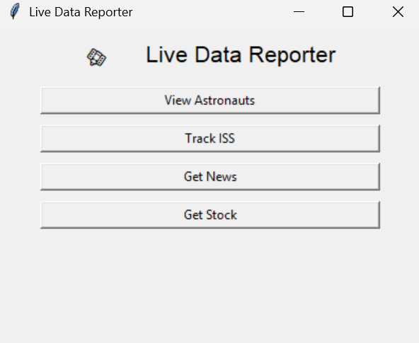

# 🛰️ Live Data Reporter (GUI Edition)

Live Data Reporter is a Python-powered STEM toolkit that brings real-time space, finance, and world events to your desktop — now with a visual GUI and interactive map tracking of the International Space Station.

Whether you're a student, educator, or just a curious mind, this tool turns live APIs into a playground of data exploration.



---

## 🌟 Highlights

| Feature            | Description                                                                 |
|--------------------|-----------------------------------------------------------------------------|
| 👨‍🚀 View Astronauts     | See who's currently in space using Open Notify API                       |
| 🛰️ Track ISS          | Real-time ISS location + visual map via turtle graphics                   |
| 📰 Get News           | Top 3 business headlines from NewsAPI                                      |
| 📈 Stock Price       | IBM 5-minute stock update via Alpha Vantage                                |
| 🧠 Smart Caching      | Reduces API calls with auto-refreshing data cache                         |
| ✅ Action Logging     | Transparent logging to `logs.txt` with time & module                      |
| 💡 GUI Interface      | Built in `tkinter`, no need for terminal commands                         |

---

## 🛠️ Setup Instructions

### 1. Clone the Repository

```bash
git clone https://github.com/YOUR_USERNAME/live-data-reporter.git
cd live-data-reporter
```

### 2. Create a Virtual Environment (Optional but encouraged)

```bash
python -m venv venv
source venv/bin/activate  # or venv\Scripts\activate on Windows
```

### 3. Install Dependencies

```bash
pip install -r requirements.txt
```

### 4. Configure API Keys

Create a `.env` file in the root folder with these contents:

```env
NEWS_API_KEY=your_newsapi_key_here
STOCK_API_KEY=your_alpha_vantage_key_here
```

Use the provided `.env.example` for reference.

---

## 🚀 How to Run

### Launch the GUI

```bash
python gui.py
```

Then just click:

- 🧑‍🚀 **View Astronauts**
- 🛰️ **Track ISS** (opens turtle window with live map!)
- 📰 **Fetch News**
- 📈 **Fetch Stock**

> All logs go to `logs.txt`, and data is written to `data/iss_data.txt`

---

## 📁 Project Structure

```
live-data-reporter/
├── gui.py                  # GUI interface with tkinter
├── main.py                 # Optional CLI menu
├── astronauts.py           # Astronaut data fetcher + caching
├── iss_tracker.py          # ISS tracker + turtle map visuals
├── news_or_stock.py        # News + stock fetcher with caching
├── utils/
│   └── cache.py            # Smart file caching utils
├── data/
│   └── iss_data.txt        # Output file
├── cache/
│   └── *.json              # Cached responses
├── images/
│   ├── map.png             # Background for turtle map
│   └── iss.png             # ISS turtle icon
├── logs.txt                # Log of all actions
├── .env.example            # Sample .env file
├── README.md               # You are here
```

---

## 🎓 Educational Purpose

This project was built to support STEM learning by giving students hands-on access to live data:

- Python fundamentals
- API consumption and parsing
- Visualization with Turtle
- Logging, caching, and environment config

Perfect for Python classrooms, data science experiments, or maker-space integrations!

---

## 📄 License

MIT — use it, remix it, teach with it!

---

## 🙌 Author

Built by **Rediet** — blending curiosity, clean code, and creativity 🚀
